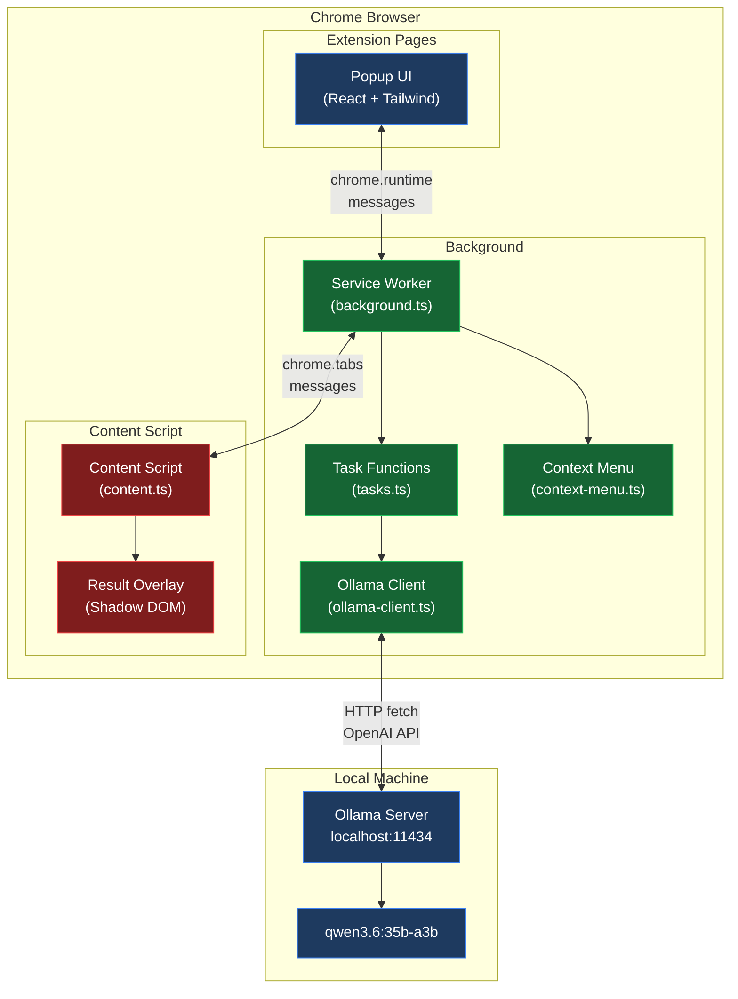
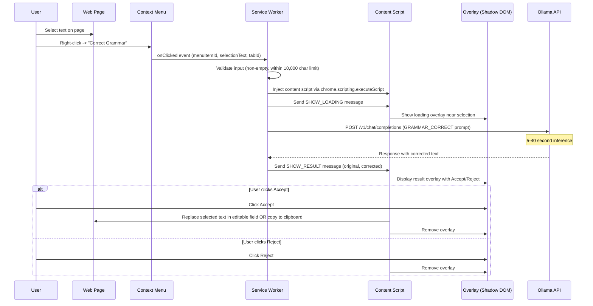
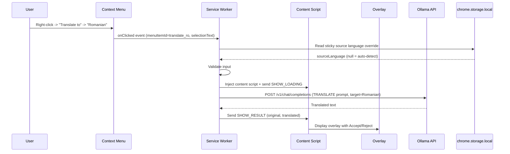
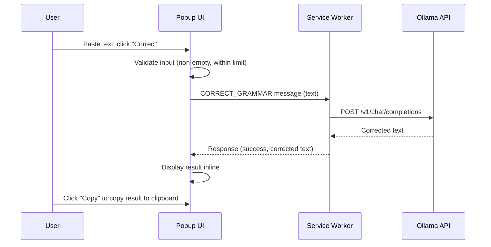
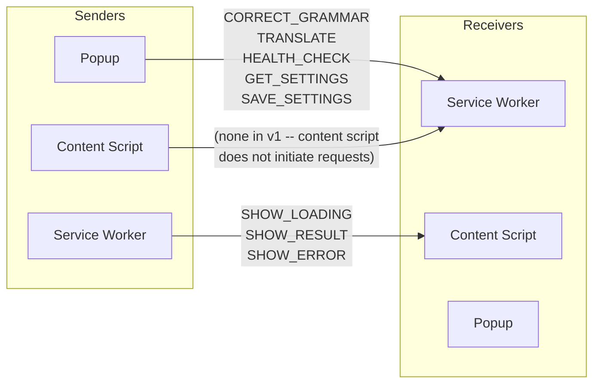
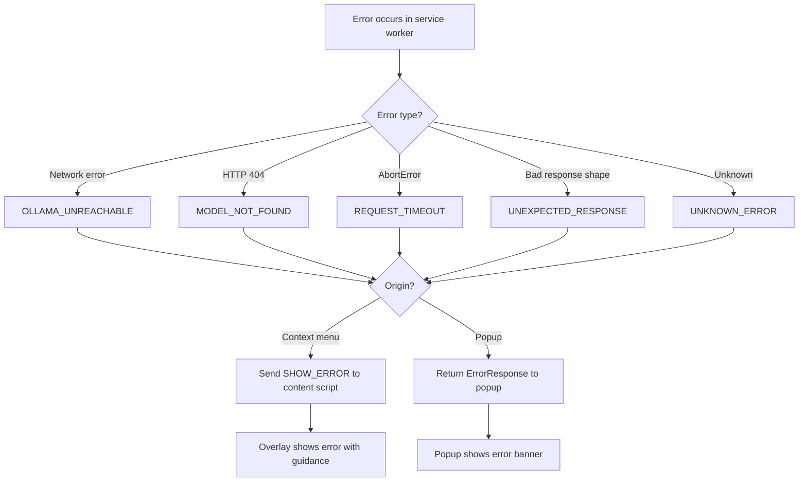

# Architecture Document -- Correct & Translate Chrome Extension

**Date**: 2026-05-20
**Author**: chrome-extension-architect
**Version**: 1.0
**Status**: PENDING USER APPROVAL

---

## Table of Contents

1. [Architecture Overview](#1-architecture-overview)
2. [Component Breakdown](#2-component-breakdown)
3. [Manifest V3 Design](#3-manifest-v3-design)
4. [File and Folder Structure](#4-file-and-folder-structure)
5. [Data Flow Diagram](#5-data-flow-diagram)
6. [Message Flow and Typed Contracts](#6-message-flow-and-typed-contracts)
7. [Storage Model](#7-storage-model)
8. [Context Menu Design](#8-context-menu-design)
9. [Overlay and Result UI Design](#9-overlay-and-result-ui-design)
10. [Error Handling Strategy](#10-error-handling-strategy)
11. [Security Considerations](#11-security-considerations)
12. [Testing Strategy](#12-testing-strategy)
13. [Implementation Checklist](#13-implementation-checklist)

---

## 1. Architecture Overview

### 1.1 Goals

- Provide grammar/spelling correction and translation (EN, DE, RO) via local Ollama LLM
- Minimal, focused v1 -- no style improvement, reformulation, or default language mode
- Private-use only -- no Chrome Web Store, no telemetry, no cloud
- Secure, maintainable, well-typed codebase

### 1.2 Non-Goals (v1)

- Writing style improvement (v2)
- Sentence reformulation (v2)
- Default language mode (v2)
- Streaming responses (v2)
- Side panel UI
- Cross-browser support
- Chrome Web Store publication
- User accounts or cloud sync

### 1.3 Assumptions

- Ollama runs locally on `http://localhost:11434`
- User's machine: Apple M4 Pro, 48 GB unified memory
- Model `qwen3.6:35b-a3b` is pulled and available
- Only English, German, and Romanian are supported
- The user understands that LLM inference takes 5-40 seconds depending on model load state

### 1.4 High-Level Architecture Diagram



**Trust boundary**: The service worker and extension pages are trusted. Content scripts operate in the webpage context and are treated as an untrusted boundary. All data crossing from content scripts to the service worker must be validated.

---

## 2. Component Breakdown

### 2.1 Service Worker (`src/background/`)

The service worker is the central hub. It:

- Registers and handles context menu clicks
- Receives messages from the popup and content scripts
- Calls the Ollama API via the Ollama client module
- Validates all incoming messages against typed contracts
- Returns results to the requesting component
- Performs health checks on Ollama
- Warms up the model on extension install/startup

The service worker never touches the DOM. It is the only component that communicates with Ollama.

**Lifecycle considerations**: Manifest V3 service workers are ephemeral. They can be terminated after 30 seconds of inactivity. However, active fetch requests and open message channels keep the service worker alive. Since Ollama calls can take up to 60 seconds, the service worker will remain alive for the duration of each request. No special keep-alive mechanism is needed for v1 non-streaming calls.

### 2.2 Content Script (`src/content/`)

The content script is injected into web pages when the user invokes an action (via `activeTab` + `scripting`). It:

- Reads the currently selected text from the page
- Receives results from the service worker
- Renders the result overlay using Shadow DOM (isolated styles)
- Handles accept (replace text in editable fields or copy to clipboard) and reject (dismiss)
- Cleans up the overlay when dismissed

The content script never calls Ollama directly. It only communicates with the service worker via `chrome.runtime.sendMessage` and `chrome.runtime.onMessage`.

**Injection strategy**: The content script is injected programmatically via `chrome.scripting.executeScript` when the user triggers a context menu action. This avoids persistent content script injection on all pages and works with `activeTab` permission.

### 2.3 Popup UI (`src/popup/`)

A React application rendered in the extension popup. It provides:

- **Settings section**: Ollama endpoint URL, model selector dropdown, default target language
- **Quick action section**: Text input area, action buttons (Correct, Translate), target language dropdown
- **Status indicator**: Ollama connection status (green dot = connected, red dot = unreachable, yellow dot = connected but model not found)
- **Source language override**: Auto-detect (default) or manual selection (EN/DE/RO), sticky -- persisted in storage

The popup communicates with the service worker via `chrome.runtime.sendMessage` for both settings changes and text processing requests. Results from quick actions are displayed inline in the popup (not in an overlay on the page).

### 2.4 Shared Modules (`src/shared/`)

Shared code used by multiple components:

| Module | Purpose |
|--------|---------|
| `messages.ts` | Typed message interfaces and type guards |
| `storage.ts` | Storage abstraction over `chrome.storage.local` |
| `constants.ts` | Shared constants (languages, default values, limits) |
| `prompts.ts` | Prompt templates for grammar correction and translation |
| `errors.ts` | Error types and user-facing error messages |
| `validators.ts` | Input validation functions (text length, language codes) |

---

## 3. Manifest V3 Design

### 3.1 Complete Manifest

```json
{
  "manifest_version": 3,
  "name": "Correct & Translate",
  "version": "1.0.0",
  "description": "Grammar correction and translation powered by local Ollama LLM.",

  "permissions": [
    "storage",
    "activeTab",
    "contextMenus",
    "scripting"
  ],

  "host_permissions": [
    "http://localhost:11434/*"
  ],

  "background": {
    "service_worker": "src/background/service-worker.ts",
    "type": "module"
  },

  "action": {
    "default_popup": "popup.html",
    "default_icon": {
      "16": "icons/icon-16.png",
      "32": "icons/icon-32.png",
      "48": "icons/icon-48.png",
      "128": "icons/icon-128.png"
    }
  },

  "icons": {
    "16": "icons/icon-16.png",
    "32": "icons/icon-32.png",
    "48": "icons/icon-48.png",
    "128": "icons/icon-128.png"
  },

  "content_security_policy": {
    "extension_pages": "script-src 'self'; object-src 'none'; connect-src 'self' http://localhost:11434"
  }
}
```

**Note**: The `service_worker` path above reflects the source structure. After Vite build, the actual path will be the compiled output (e.g., `background.js`). The Vite Chrome extension plugin handles this mapping.

### 3.2 Permission Justification Table

| Permission | Type | Justification | Alternatives Considered |
|------------|------|---------------|------------------------|
| `storage` | API | Store user settings: Ollama endpoint, selected model, default target language, sticky source language override | None -- required for settings persistence |
| `activeTab` | API | Access the active tab to read selected text and inject the content script when user triggers a context menu action | `<all_urls>` host permission -- rejected as overly broad |
| `contextMenus` | API | Register right-click menu items for "Correct Grammar" and "Translate to" actions | Popup-only UI -- rejected because context menu is a core interaction |
| `scripting` | API | Programmatically inject the content script into the active tab when user triggers an action. Required because we do not declare persistent content scripts | Declarative `content_scripts` in manifest -- rejected because it would inject on every page load, which is unnecessary and wasteful |
| `http://localhost:11434/*` | Host | Service worker must call the Ollama API at this endpoint | No alternative -- Ollama runs on localhost only |

### 3.3 Permissions NOT Included (and Why)

| Permission | Why Excluded |
|------------|-------------|
| `<all_urls>` | Not needed -- `activeTab` grants temporary access to the current tab when user invokes the extension |
| `tabs` | Not needed -- `activeTab` is sufficient; we do not need to enumerate or modify other tabs |
| `sidePanel` | Not in v1 scope |
| `clipboardWrite` | The Clipboard API (`navigator.clipboard.writeText`) works in extension contexts without this permission |
| `notifications` | Not needed for v1 -- errors shown in popup or overlay |
| `webRequest` | No request interception needed |

---

## 4. File and Folder Structure

```
chrome.correct.and.reformulate.plugin/
+-- docs/
|   +-- architecture.md              # This document
|   +-- meeting-notes-kickoff.md     # Kickoff meeting notes
|   +-- dispatch-plan.md             # Agent dispatch plan
|   +-- ollama-evaluation.md         # Model evaluation results
|
+-- src/
|   +-- background/
|   |   +-- service-worker.ts        # Service worker entry point
|   |   +-- context-menu.ts          # Context menu registration and handlers
|   |   +-- ollama-client.ts         # Ollama API client (fetch-based)
|   |   +-- tasks.ts                 # Task functions (correctGrammar, translateText)
|   |   +-- message-handler.ts       # Message router and dispatcher
|   |
|   +-- content/
|   |   +-- content.ts               # Content script entry point
|   |   +-- overlay.ts               # Result overlay (Shadow DOM)
|   |   +-- overlay.css              # Overlay styles (injected into Shadow DOM)
|   |   +-- text-replacement.ts      # Text replacement in editable fields
|   |
|   +-- popup/
|   |   +-- Popup.tsx                # Root popup component
|   |   +-- components/
|   |   |   +-- StatusIndicator.tsx   # Ollama connection status dot
|   |   |   +-- SettingsSection.tsx   # Settings form (endpoint, model, language)
|   |   |   +-- QuickAction.tsx       # Text input + action buttons
|   |   |   +-- ResultDisplay.tsx     # Inline result display for popup actions
|   |   |   +-- LanguageSelector.tsx  # Language dropdown (reusable)
|   |   +-- popup.css                # Popup-specific Tailwind entry
|   |   +-- main.tsx                 # React mount point
|   |
|   +-- shared/
|   |   +-- messages.ts              # Typed message interfaces and type guards
|   |   +-- storage.ts               # Storage abstraction
|   |   +-- constants.ts             # Languages, defaults, limits
|   |   +-- prompts.ts               # Prompt templates
|   |   +-- errors.ts                # Error types and messages
|   |   +-- validators.ts            # Input validation
|   |   +-- types.ts                 # Shared type definitions
|   |
|   +-- icons/
|       +-- icon-16.png
|       +-- icon-32.png
|       +-- icon-48.png
|       +-- icon-128.png
|
+-- public/
|   +-- popup.html                   # Popup HTML shell
|
+-- tests/
|   +-- unit/
|   |   +-- validators.test.ts
|   |   +-- prompts.test.ts
|   |   +-- messages.test.ts
|   |   +-- storage.test.ts
|   |   +-- ollama-client.test.ts
|   |   +-- tasks.test.ts
|   +-- integration/
|       +-- message-flow.test.ts
|
+-- package.json
+-- pnpm-lock.yaml
+-- tsconfig.json
+-- vite.config.ts
+-- tailwind.config.ts
+-- postcss.config.js
+-- eslint.config.js
+-- .gitignore
+-- README.md
```

---

## 5. Data Flow Diagram

### 5.1 Context Menu Flow (Correct Grammar)



### 5.2 Context Menu Flow (Translate)



### 5.3 Popup Quick Action Flow



---

## 6. Message Flow and Typed Contracts

### 6.1 Message Direction Map



The content script in v1 does not initiate messages to the service worker. All context menu actions originate from `chrome.contextMenus.onClicked` in the service worker, which then sends messages to the content script. The content script only receives.

### 6.2 TypeScript Message Interfaces

```typescript
// src/shared/messages.ts

// ============================================================
// Language and Action Types
// ============================================================

export type SupportedLanguage = 'English' | 'German' | 'Romanian';
export type LanguageCode = 'en' | 'de' | 'ro';
export type ActionType = 'correct' | 'translate';

// ============================================================
// Messages: Popup -> Service Worker
// ============================================================

export interface CorrectGrammarRequest {
  type: 'CORRECT_GRAMMAR';
  payload: {
    text: string;
  };
}

export interface TranslateRequest {
  type: 'TRANSLATE';
  payload: {
    text: string;
    targetLanguage: SupportedLanguage;
    sourceLanguage: SupportedLanguage | null; // null = auto-detect
  };
}

export interface HealthCheckRequest {
  type: 'HEALTH_CHECK';
}

export interface GetSettingsRequest {
  type: 'GET_SETTINGS';
}

export interface SaveSettingsRequest {
  type: 'SAVE_SETTINGS';
  payload: {
    settings: Partial<ExtensionSettings>;
  };
}

export type PopupToServiceWorkerMessage =
  | CorrectGrammarRequest
  | TranslateRequest
  | HealthCheckRequest
  | GetSettingsRequest
  | SaveSettingsRequest;

// ============================================================
// Messages: Service Worker -> Content Script
// ============================================================

export interface ShowLoadingMessage {
  type: 'SHOW_LOADING';
  payload: {
    action: ActionType;
    originalText: string;
  };
}

export interface ShowResultMessage {
  type: 'SHOW_RESULT';
  payload: {
    action: ActionType;
    originalText: string;
    resultText: string;
    targetLanguage?: SupportedLanguage; // present for translate actions
  };
}

export interface ShowErrorMessage {
  type: 'SHOW_ERROR';
  payload: {
    errorCode: ErrorCode;
    errorMessage: string;
  };
}

export interface DismissOverlayMessage {
  type: 'DISMISS_OVERLAY';
}

export type ServiceWorkerToContentScriptMessage =
  | ShowLoadingMessage
  | ShowResultMessage
  | ShowErrorMessage
  | DismissOverlayMessage;

// ============================================================
// Responses: Service Worker -> Popup
// ============================================================

export interface SuccessResponse {
  success: true;
  result: string;
}

export interface ErrorResponse {
  success: false;
  error: string;
  errorCode: ErrorCode;
}

export interface HealthCheckResponse {
  success: true;
  reachable: boolean;
  modelFound: boolean;
  error: string | null;
}

export interface SettingsResponse {
  success: true;
  settings: ExtensionSettings;
}

export type ServiceWorkerResponse =
  | SuccessResponse
  | ErrorResponse
  | HealthCheckResponse
  | SettingsResponse;

// ============================================================
// Error Codes
// ============================================================

export type ErrorCode =
  | 'OLLAMA_UNREACHABLE'
  | 'MODEL_NOT_FOUND'
  | 'REQUEST_TIMEOUT'
  | 'EMPTY_INPUT'
  | 'INPUT_TOO_LONG'
  | 'INVALID_MESSAGE'
  | 'UNEXPECTED_RESPONSE'
  | 'UNKNOWN_ERROR';

// ============================================================
// Settings (also used by storage model)
// ============================================================

export interface ExtensionSettings {
  ollamaEndpoint: string;
  model: string;
  defaultTargetLanguage: SupportedLanguage;
  sourceLanguageOverride: SupportedLanguage | null; // null = auto-detect
}

// ============================================================
// Type Guards
// ============================================================

const VALID_TYPES: ReadonlySet<string> = new Set([
  'CORRECT_GRAMMAR',
  'TRANSLATE',
  'HEALTH_CHECK',
  'GET_SETTINGS',
  'SAVE_SETTINGS',
  'SHOW_LOADING',
  'SHOW_RESULT',
  'SHOW_ERROR',
  'DISMISS_OVERLAY',
]);

export function isValidMessageType(type: unknown): type is string {
  return typeof type === 'string' && VALID_TYPES.has(type);
}

export function isCorrectGrammarRequest(msg: unknown): msg is CorrectGrammarRequest {
  return (
    typeof msg === 'object' &&
    msg !== null &&
    (msg as CorrectGrammarRequest).type === 'CORRECT_GRAMMAR' &&
    typeof (msg as CorrectGrammarRequest).payload?.text === 'string'
  );
}

export function isTranslateRequest(msg: unknown): msg is TranslateRequest {
  const m = msg as TranslateRequest;
  return (
    typeof msg === 'object' &&
    msg !== null &&
    m.type === 'TRANSLATE' &&
    typeof m.payload?.text === 'string' &&
    typeof m.payload?.targetLanguage === 'string' &&
    ['English', 'German', 'Romanian'].includes(m.payload.targetLanguage)
  );
}
```

### 6.3 Message Validation Rules

All messages arriving at the service worker must be validated before processing:

| Check | Rule | On Failure |
|-------|------|------------|
| Message structure | Must have a `type` field that matches a known type | Return `ErrorResponse` with `INVALID_MESSAGE` |
| Text payload | Must be a non-empty string after trimming | Return `ErrorResponse` with `EMPTY_INPUT` |
| Text length | Must be at most 10,000 characters | Return `ErrorResponse` with `INPUT_TOO_LONG` |
| Language values | Must be one of `'English'`, `'German'`, `'Romanian'`, or `null` | Return `ErrorResponse` with `INVALID_MESSAGE` |
| Settings payload | Must conform to `Partial<ExtensionSettings>` shape | Return `ErrorResponse` with `INVALID_MESSAGE` |
| Sender origin | For content script messages, verify `sender.tab` is present | Ignore message |

---

## 7. Storage Model

### 7.1 Storage Interface

```typescript
// src/shared/storage.ts

import type { ExtensionSettings, SupportedLanguage } from './messages';

/**
 * Schema for all data stored in chrome.storage.local.
 * Every field has a default value. Missing fields are filled with defaults on read.
 */
export interface StorageSchema {
  settings: ExtensionSettings;
}

export const DEFAULT_SETTINGS: ExtensionSettings = {
  ollamaEndpoint: 'http://localhost:11434',
  model: 'qwen3.6:35b-a3b',
  defaultTargetLanguage: 'English',
  sourceLanguageOverride: null, // auto-detect
};

/**
 * Read settings from chrome.storage.local, merging with defaults.
 */
export async function getSettings(): Promise<ExtensionSettings> {
  const result = await chrome.storage.local.get('settings');
  return { ...DEFAULT_SETTINGS, ...(result.settings ?? {}) };
}

/**
 * Write partial settings to chrome.storage.local (merge, not replace).
 */
export async function saveSettings(partial: Partial<ExtensionSettings>): Promise<void> {
  const current = await getSettings();
  const updated = { ...current, ...partial };
  await chrome.storage.local.set({ settings: updated });
}
```

### 7.2 Storage Contents

| Key | Type | Default | Purpose |
|-----|------|---------|---------|
| `settings.ollamaEndpoint` | `string` | `"http://localhost:11434"` | Ollama API base URL |
| `settings.model` | `string` | `"qwen3.6:35b-a3b"` | Active Ollama model name |
| `settings.defaultTargetLanguage` | `SupportedLanguage` | `"English"` | Default target for translations |
| `settings.sourceLanguageOverride` | `SupportedLanguage \| null` | `null` | Sticky source language override; `null` means auto-detect |

### 7.3 Storage Size Estimate

Total stored data is under 500 bytes. `chrome.storage.local` has a 10 MB limit. No concerns.

### 7.4 Data Sensitivity

No sensitive data is stored. Settings contain only configuration values. The extension does not store:

- User text (processed text is never persisted)
- API keys or tokens (Ollama requires none)
- Personal information
- Browsing history or page content

---

## 8. Context Menu Design

### 8.1 Menu Structure

```
[Right-click on selected text]
|
+-- "Correct Grammar"                    (id: "correct_grammar")
+-- "Translate to"                       (id: "translate_parent")
    +-- "English"                        (id: "translate_en")
    +-- "German"                         (id: "translate_de")
    +-- "Romanian"                       (id: "translate_ro")
```

### 8.2 Registration Code Pattern

```typescript
// src/background/context-menu.ts

export function registerContextMenus(): void {
  chrome.contextMenus.removeAll(() => {
    chrome.contextMenus.create({
      id: 'correct_grammar',
      title: 'Correct Grammar',
      contexts: ['selection'],
    });

    chrome.contextMenus.create({
      id: 'translate_parent',
      title: 'Translate to',
      contexts: ['selection'],
    });

    chrome.contextMenus.create({
      id: 'translate_en',
      parentId: 'translate_parent',
      title: 'English',
      contexts: ['selection'],
    });

    chrome.contextMenus.create({
      id: 'translate_de',
      parentId: 'translate_parent',
      title: 'German',
      contexts: ['selection'],
    });

    chrome.contextMenus.create({
      id: 'translate_ro',
      parentId: 'translate_parent',
      title: 'Romanian',
      contexts: ['selection'],
    });
  });
}
```

### 8.3 Menu Item ID to Action Mapping

| Menu Item ID | Action | Target Language |
|-------------|--------|----------------|
| `correct_grammar` | `correct` | N/A |
| `translate_en` | `translate` | `English` |
| `translate_de` | `translate` | `German` |
| `translate_ro` | `translate` | `Romanian` |

### 8.4 Context Menu Click Handler Flow

1. `chrome.contextMenus.onClicked` fires in the service worker
2. Extract `info.menuItemId`, `info.selectionText`, `tab.id`
3. Validate `selectionText` is non-empty and within length limit
4. Inject content script into the tab via `chrome.scripting.executeScript`
5. Send `SHOW_LOADING` to the content script
6. Call the appropriate task function (`correctGrammar` or `translateText`)
7. On success: send `SHOW_RESULT` to the content script
8. On error: send `SHOW_ERROR` to the content script

---

## 9. Overlay and Result UI Design

### 9.1 Approach

The result overlay is rendered by the content script using **Shadow DOM** to isolate styles from the host page. This prevents the host page CSS from affecting the overlay and prevents the overlay CSS from leaking into the host page.

### 9.2 Overlay Behavior

| State | Appearance |
|-------|------------|
| **Loading** | Small floating panel near the selection. Contains a spinner animation and the action label ("Correcting..." or "Translating to Romanian..."). No buttons during loading. |
| **Result** | Panel expands to show the original text (dimmed, smaller) and the result text (prominent). Accept button (green, `#22c55e`) and Reject button (red, `#ef4444`). |
| **Error** | Panel shows error message with yellow (`#eab308`) warning icon. Dismiss button. Specific guidance text (e.g., "Ollama is not running. Start it with: ollama serve"). |

### 9.3 Positioning

1. Get the bounding rectangle of the current text selection using `window.getSelection().getRangeAt(0).getBoundingClientRect()`
2. Position the overlay below the selection, aligned to the left edge
3. If the overlay would extend beyond the viewport bottom, position it above the selection
4. If the overlay would extend beyond the viewport right, align to the right edge instead
5. The overlay has a fixed max-width of 480px and max-height of 320px with scroll for long results

### 9.4 Overlay HTML Structure (inside Shadow DOM)

```
<div class="ct-overlay">                       <!-- root container -->
  <div class="ct-overlay-header">               <!-- action label + close button -->
    <span class="ct-overlay-title">...</span>
    <button class="ct-overlay-close">X</button>
  </div>
  <div class="ct-overlay-body">
    <!-- Loading state -->
    <div class="ct-overlay-loading">
      <div class="ct-spinner"></div>
      <span>Correcting...</span>
    </div>
    <!-- Result state -->
    <div class="ct-overlay-result">
      <div class="ct-original">Original text here</div>
      <div class="ct-result">Corrected text here</div>
    </div>
    <!-- Error state -->
    <div class="ct-overlay-error">
      <span class="ct-error-icon">!</span>
      <span class="ct-error-message">Error message</span>
    </div>
  </div>
  <div class="ct-overlay-actions">
    <button class="ct-btn-accept">Accept</button>
    <button class="ct-btn-reject">Reject</button>
  </div>
</div>
```

### 9.5 Styling Approach

- All styles scoped inside Shadow DOM -- no global CSS leakage
- CSS class prefix `ct-` (correct-translate) to avoid collisions in the unlikely case of Shadow DOM penetration
- Colors: background `#1e1e2e`, text `#cdd6f4`, accent green `#22c55e`, accent red `#ef4444`, warning yellow `#eab308`
- Font: system font stack (`-apple-system, BlinkMacSystemFont, 'Segoe UI', Roboto, sans-serif`)
- Border radius: 8px
- Box shadow for elevation
- Smooth fade-in animation on appear

### 9.6 Accept and Reject Behavior

| Action | Context Menu Origin | Popup Origin |
|--------|-------------------|--------------|
| **Accept** | If selection is inside an editable element (`<textarea>`, `<input>`, `contenteditable`): replace the selected text with the result. Otherwise: copy result to clipboard and show brief "Copied" toast. | Copy result to clipboard. Show "Copied" confirmation in the popup. |
| **Reject** | Dismiss overlay. No changes. | Clear the result display. No changes. |

### 9.7 Keyboard Support

| Key | Action |
|-----|--------|
| `Enter` | Accept result (when overlay is focused) |
| `Escape` | Reject / dismiss overlay |
| `Tab` | Move focus between Accept and Reject buttons |

### 9.8 Cleanup

- Only one overlay exists at a time. Creating a new overlay removes any existing one.
- Overlay is removed from the DOM on dismiss.
- All event listeners are removed on cleanup.
- The Shadow DOM host element is removed from `document.body`.

---

## 10. Error Handling Strategy

### 10.1 Error Types and User-Facing Messages

| Error Code | Condition | User-Facing Message | Color |
|------------|-----------|---------------------|-------|
| `OLLAMA_UNREACHABLE` | Ollama server not running or network error | "Cannot reach Ollama. Make sure it is running: `ollama serve`" | Red `#ef4444` |
| `MODEL_NOT_FOUND` | HTTP 404 from Ollama -- model not pulled | "Model not found. Pull it first: `ollama pull qwen3.6:35b-a3b`" | Red `#ef4444` |
| `REQUEST_TIMEOUT` | Ollama did not respond within 60 seconds | "Request timed out. The model may be loading. Try again, or switch to a faster model (qwen3:14b) in settings." | Yellow `#eab308` |
| `EMPTY_INPUT` | User submitted empty or whitespace-only text | "No text provided. Select some text first." | Yellow `#eab308` |
| `INPUT_TOO_LONG` | Input exceeds 10,000 characters | "Text is too long (max 10,000 characters). Select a shorter passage." | Yellow `#eab308` |
| `UNEXPECTED_RESPONSE` | Ollama returned an unexpected response shape | "Received an unexpected response from Ollama. Check if Ollama is working correctly." | Red `#ef4444` |
| `UNKNOWN_ERROR` | Any unhandled error | "An unexpected error occurred. Check the browser console for details." | Red `#ef4444` |
| `INVALID_MESSAGE` | Malformed message received | (Logged to console, not shown to user) | -- |

### 10.2 Error Flow



### 10.3 Error Handling Principles

1. **Never show raw error objects to users** -- always map to a user-facing message
2. **Always log the full error to the console** for debugging (`console.error` in service worker)
3. **Never include sensitive data in error messages** (no request bodies, no URLs with parameters)
4. **Provide actionable guidance** where possible ("run `ollama serve`", "switch to qwen3:14b")
5. **Use color coding consistently**: red for hard failures, yellow for soft failures or user errors
6. **Timeout errors get yellow** because they are often transient (model loading on first call)
7. **Do not retry automatically** in v1 -- let the user decide

### 10.4 Input Validation (Pre-Request)

Validation happens before any Ollama call:

```typescript
// src/shared/validators.ts

export const MAX_INPUT_LENGTH = 10_000;

export interface ValidationResult {
  valid: boolean;
  errorCode?: ErrorCode;
  errorMessage?: string;
}

export function validateTextInput(text: unknown): ValidationResult {
  if (typeof text !== 'string' || text.trim() === '') {
    return { valid: false, errorCode: 'EMPTY_INPUT', errorMessage: 'No text provided.' };
  }
  if (text.length > MAX_INPUT_LENGTH) {
    return {
      valid: false,
      errorCode: 'INPUT_TOO_LONG',
      errorMessage: `Text is too long (${text.length} characters, max ${MAX_INPUT_LENGTH}).`,
    };
  }
  return { valid: true };
}
```

---

## 11. Security Considerations

### 11.1 Threat Model

| Threat | Description | Severity | Mitigation |
|--------|-------------|----------|------------|
| **T1: Malicious page DOM manipulation** | A malicious webpage could craft DOM content to inject code when the content script reads selection text | Medium | The content script reads `selectionText` from the `chrome.contextMenus.onClicked` info object, which is provided by Chrome, not from `window.getSelection()` directly. For display in the overlay, text is inserted via `textContent`, never `innerHTML`. |
| **T2: Message spoofing from web page** | A webpage could try to send messages to the extension via `chrome.runtime.sendMessage` (externally connectable) | Low | The extension does not declare `externally_connectable` in the manifest. Web pages cannot send messages to the extension. Content script messages are validated by checking `sender.tab`. |
| **T3: Ollama response injection** | Ollama could return text containing HTML/script that gets injected into the page | Medium | All Ollama responses are inserted into the overlay via `textContent` (not `innerHTML`). When replacing text in editable fields, the result is set as plain text value, not HTML. |
| **T4: Content script style leakage** | Overlay CSS could break the host page, or host page CSS could break the overlay | Low | Shadow DOM isolates all overlay styles. Overlay uses a `ct-` prefix for all CSS classes as an additional safeguard. |
| **T5: Localhost SSRF** | The extension calls `localhost:11434`. If the host permission were broader, it could be used to probe other local services | Low | Host permission is restricted to exactly `http://localhost:11434/*`. No other local endpoints are accessible. |
| **T6: Storage tampering** | Another extension or malicious code could modify `chrome.storage.local` | Low | `chrome.storage.local` is per-extension and isolated by Chrome. Only this extension can read/write its own storage. Settings are validated on read. |
| **T7: Service worker message validation bypass** | Malformed messages could cause crashes or unexpected behavior | Medium | All messages are validated with type guards before processing. Unknown message types are rejected. Payloads are checked for expected shape and value ranges. |
| **T8: Text replacement in editable fields** | Replacing text in `contenteditable` elements could inject HTML | Medium | Text replacement uses `document.execCommand('insertText')` for `contenteditable` (plain text only) and `.value` assignment for `<textarea>`/`<input>`. Never uses `innerHTML` for replacement. |

### 11.2 Content Security Policy

```json
{
  "content_security_policy": {
    "extension_pages": "script-src 'self'; object-src 'none'; connect-src 'self' http://localhost:11434"
  }
}
```

- `script-src 'self'` -- only scripts from the extension bundle can execute. No inline scripts, no `eval`, no remote scripts.
- `object-src 'none'` -- no plugins (Flash, Java, etc.)
- `connect-src 'self' http://localhost:11434` -- network requests only to the extension itself and Ollama

### 11.3 DOM Safety Rules

1. **Never use `innerHTML`** to insert user text or Ollama responses. Always use `textContent` or `createTextNode`.
2. **Never use `eval`** or `new Function`.
3. **Never use `document.write`**.
4. **Overlay DOM is inside Shadow DOM** -- isolated from the host page.
5. **Text replacement** in editable fields uses safe methods (`insertText` command or `.value` assignment).

### 11.4 Message Validation Rules

1. Every message entering the service worker is validated against typed contracts.
2. Unknown message types are rejected with an error response (not silently dropped).
3. Text payloads are trimmed and length-checked.
4. Language values are checked against the allowed set.
5. Settings payloads are validated field-by-field; invalid fields are silently ignored.

### 11.5 Network Safety

1. The service worker is the only component that makes network requests.
2. Content scripts never call `fetch` or `XMLHttpRequest`.
3. The popup never calls `fetch` directly -- it communicates through the service worker.
4. All Ollama requests go to the configured endpoint (default `http://localhost:11434`).
5. The endpoint is configurable but limited to the host permission in the manifest. If the user changes it, it must still match `http://localhost:11434/*` or the request will be blocked by Chrome.

### 11.6 Web Accessible Resources

None. The extension does not expose any resources to web pages.

### 11.7 Security Checklist

- [x] Manifest V3 used
- [x] Permissions are minimal and justified (see Section 3.2)
- [x] Host permissions are minimal (`http://localhost:11434/*` only)
- [x] No `<all_urls>`
- [x] `activeTab` used instead of broad tab access
- [x] No remote code loading
- [x] No `eval`, `new Function`, or unsafe-inline
- [x] CSP is strict (Section 11.2)
- [x] All messages validated with type guards (Section 6.3)
- [x] Content script treated as untrusted boundary
- [x] DOM injection uses `textContent`, never `innerHTML`
- [x] Shadow DOM isolates overlay styles
- [x] No secrets in code (Ollama requires no API key)
- [x] No user data stored (text is never persisted)
- [x] No web accessible resources
- [x] Errors do not leak sensitive information
- [x] Input length is bounded (10,000 characters)

---

## 12. Testing Strategy

### 12.1 Unit Tests (Vitest)

| Module | What to Test |
|--------|-------------|
| `validators.ts` | Empty input, whitespace-only, exactly at limit, over limit, non-string types, valid input |
| `prompts.ts` | Prompt templates produce correct system prompts for each action/language combination |
| `messages.ts` | Type guards correctly accept valid messages and reject invalid ones |
| `storage.ts` | Defaults applied when storage is empty, partial update merges correctly, invalid values handled |
| `ollama-client.ts` | Mock fetch: success response parsing, timeout handling, network error handling, HTTP 404 handling, empty response handling, invalid JSON handling |
| `tasks.ts` | `correctGrammar` calls `callOllama` with correct prompt; `translateText` with auto-detect vs explicit source |
| `context-menu.ts` | Menu item ID mapping to action and target language |
| `errors.ts` | Error code to user-facing message mapping |

### 12.2 Integration Tests

| Scenario | How |
|----------|-----|
| Message flow: popup -> service worker -> response | Mock `chrome.runtime.sendMessage`, verify correct task function called and response returned |
| Context menu click -> content script injection | Mock `chrome.contextMenus.onClicked`, verify `chrome.scripting.executeScript` called with correct tab |
| Settings persistence | Write settings, read back, verify merge with defaults |

### 12.3 Manual Testing Checklist

| Test Case | Steps | Expected |
|-----------|-------|----------|
| **Grammar correction (EN)** | Select "She dont know nothing" on a page, right-click, "Correct Grammar" | Overlay shows corrected text. Accept replaces. |
| **Grammar correction (DE)** | Select German text with errors, right-click, "Correct Grammar" | Overlay shows corrected German text with proper grammar. |
| **Grammar correction (RO)** | Select Romanian text without diacritics, right-click, "Correct Grammar" | Overlay shows text with restored diacritics (ă, â, î, ș, ț). |
| **Translation EN->RO** | Select English text, right-click, "Translate to" -> "Romanian" | Overlay shows Romanian translation. |
| **Translation DE->EN** | Select German text, right-click, "Translate to" -> "English" | Overlay shows English translation. |
| **Translation RO->DE** | Select Romanian text, right-click, "Translate to" -> "German" | Overlay shows German translation. |
| **Popup: Correct** | Open popup, paste text, click "Correct" | Result shown inline in popup. |
| **Popup: Translate** | Open popup, paste text, select target language, click "Translate" | Translation shown inline. |
| **Popup: Settings** | Change model to `qwen3:14b`, close and reopen popup | Setting persists. |
| **Popup: Status** | With Ollama running, check status indicator | Green dot. |
| **Popup: Status (Ollama off)** | Stop Ollama, open popup | Red dot with error message. |
| **Source language override** | In popup, set source language to "German", close popup, translate text | Override persists and is used. |
| **Source language reset** | Set override back to "Auto-detect" | Auto-detect is used. |
| **Empty selection** | Right-click with no text selected | Context menu items should not appear (they are `contexts: ['selection']`). |
| **Long text** | Select text > 10,000 characters | Error message about text being too long. |
| **Accept in editable field** | Correct text inside a `<textarea>`, click Accept | Text replaced in the textarea. |
| **Accept in non-editable** | Correct text on a static page, click Accept | Text copied to clipboard with confirmation. |
| **Reject** | Show result overlay, click Reject | Overlay dismissed, no changes. |
| **Keyboard: Escape** | Show result overlay, press Escape | Overlay dismissed. |
| **Keyboard: Enter** | Show result overlay, press Enter | Result accepted. |
| **Ollama timeout** | Stop Ollama mid-request (or set very short timeout) | Yellow timeout error with guidance. |
| **Already correct text** | Select "The meeting is at 10 AM." and correct | Overlay shows same text (unchanged). Accept replaces with identical text. |

### 12.4 Test Infrastructure

- **Unit tests**: Vitest with `vi.mock` for Chrome APIs
- **Chrome API mocks**: Create `tests/mocks/chrome.ts` that stubs `chrome.runtime`, `chrome.storage`, `chrome.contextMenus`, `chrome.scripting`, `chrome.tabs`
- **No E2E framework in v1**: Manual testing is sufficient for a private-use extension. Playwright for Chrome extensions can be evaluated for v2.
- **CI (optional)**: `pnpm lint && pnpm typecheck && pnpm test && pnpm build`

---

## 13. Implementation Checklist

Ordered list of tasks for the developer agent. Each phase has a gate that must pass before proceeding.

### Phase 1 -- Project Foundation

- [ ] Initialize pnpm project (`pnpm init`)
- [ ] Install core dependencies: `react`, `react-dom`, `typescript`
- [ ] Install dev dependencies: `vite`, `@crxjs/vite-plugin` (or `vite-plugin-chrome-extension`), `tailwindcss`, `postcss`, `autoprefixer`, `vitest`, `eslint`, `@types/chrome`, `@types/react`, `@types/react-dom`
- [ ] Configure `tsconfig.json` with `strict: true`, `moduleResolution: "bundler"`, target ES2022
- [ ] Configure `vite.config.ts` for Chrome extension output (manifest as input)
- [ ] Configure `tailwind.config.ts` with content paths for popup
- [ ] Configure `postcss.config.js`
- [ ] Configure `eslint.config.js` (flat config)
- [ ] Create `manifest.json` per Section 3.1
- [ ] Create icon placeholder files (16, 32, 48, 128)
- [ ] Create `public/popup.html` shell
- [ ] Create `.gitignore` (node_modules, dist, .vite)
- [ ] Verify `pnpm build` produces a loadable extension
- [ ] Verify extension loads in `chrome://extensions` (developer mode)

**Gate**: Extension loads in Chrome with no errors in the console.

### Phase 2 -- Shared Modules

- [ ] Implement `src/shared/constants.ts` (languages, defaults, limits)
- [ ] Implement `src/shared/types.ts` (shared type definitions)
- [ ] Implement `src/shared/messages.ts` (message interfaces and type guards per Section 6.2)
- [ ] Implement `src/shared/validators.ts` (input validation per Section 10.4)
- [ ] Implement `src/shared/errors.ts` (error codes and user-facing messages per Section 10.1)
- [ ] Implement `src/shared/prompts.ts` (prompt templates from `ollama-evaluation.md` Section 7)
- [ ] Implement `src/shared/storage.ts` (storage abstraction per Section 7)
- [ ] Write unit tests for all shared modules
- [ ] Verify `pnpm test` passes

**Gate**: All shared module tests pass. `pnpm typecheck` clean.

### Phase 3 -- Service Worker (Background)

- [ ] Implement `src/background/ollama-client.ts` (fetch-based Ollama client from `ollama-evaluation.md` Section 8.2, converted to TypeScript)
- [ ] Implement `src/background/tasks.ts` (correctGrammar, translateText from `ollama-evaluation.md` Section 8.3, converted to TypeScript)
- [ ] Implement `src/background/context-menu.ts` (registration per Section 8.2)
- [ ] Implement `src/background/message-handler.ts` (message router with validation)
- [ ] Implement `src/background/service-worker.ts` (entry point: register context menus on install, wire message handler, wire context menu click handler)
- [ ] Add model warm-up call on `chrome.runtime.onInstalled` and `chrome.runtime.onStartup`
- [ ] Write unit tests for `ollama-client.ts` (mock fetch)
- [ ] Write unit tests for `tasks.ts`
- [ ] Write unit tests for `message-handler.ts`
- [ ] Verify context menus appear when right-clicking selected text
- [ ] Verify Ollama health check works (manually test with Ollama running and stopped)

**Gate**: Context menus appear. Health check returns correct status. Unit tests pass.

### Phase 4 -- Content Script and Overlay

- [ ] Implement `src/content/overlay.ts` (Shadow DOM overlay per Section 9)
- [ ] Implement `src/content/overlay.css` (styles per Section 9.5)
- [ ] Implement `src/content/text-replacement.ts` (replace text in editable fields, copy to clipboard for non-editable)
- [ ] Implement `src/content/content.ts` (entry point: listen for messages from service worker, manage overlay lifecycle)
- [ ] Wire context menu click handler to inject content script and send messages
- [ ] Test loading state display
- [ ] Test result display with Accept/Reject
- [ ] Test error display
- [ ] Test keyboard navigation (Escape, Enter, Tab)
- [ ] Test text replacement in `<textarea>`, `<input>`, `contenteditable`
- [ ] Test clipboard copy for non-editable text
- [ ] Test overlay positioning (below selection, viewport boundary handling)
- [ ] Test overlay cleanup (only one overlay at a time)

**Gate**: Full context menu flow works end-to-end (select text -> right-click -> overlay -> accept/reject). All overlay states render correctly.

### Phase 5 -- Popup UI

- [ ] Implement `src/popup/main.tsx` (React mount point)
- [ ] Implement `src/popup/Popup.tsx` (root component with settings + quick action sections)
- [ ] Implement `src/popup/components/StatusIndicator.tsx` (green/red/yellow dot)
- [ ] Implement `src/popup/components/SettingsSection.tsx` (endpoint, model, default language, source override)
- [ ] Implement `src/popup/components/LanguageSelector.tsx` (reusable dropdown)
- [ ] Implement `src/popup/components/QuickAction.tsx` (text area, action buttons)
- [ ] Implement `src/popup/components/ResultDisplay.tsx` (inline result with copy button)
- [ ] Implement `src/popup/popup.css` (Tailwind entry + popup-specific styles)
- [ ] Wire popup to service worker messaging
- [ ] Test settings persistence (change, close popup, reopen)
- [ ] Test Ollama status indicator (running/stopped/wrong model)
- [ ] Test quick grammar correction from popup
- [ ] Test quick translation from popup
- [ ] Test error states in popup
- [ ] Test popup dimensions and layout (400px width recommended)

**Gate**: Popup renders correctly. Settings persist. Quick actions work. Status indicator reflects Ollama state.

### Phase 6 -- Polish and QA Preparation

- [ ] Review all error messages for clarity and actionability
- [ ] Review all color coding (green `#22c55e`, red `#ef4444`, yellow `#eab308`)
- [ ] Add focus management to overlay (auto-focus Accept button)
- [ ] Test with multiple monitor setups and zoom levels
- [ ] Run `pnpm lint` and fix all warnings
- [ ] Run `pnpm typecheck` and fix all errors
- [ ] Run `pnpm test` and ensure all tests pass
- [ ] Run `pnpm build` and verify clean output
- [ ] Review build output for unexpected files or large bundles
- [ ] Manual testing: run through every test case in Section 12.3

**Gate**: All automated checks pass. Manual testing checklist complete. No critical bugs.

---

## Appendix A: Color Reference

| Purpose | Color | Hex | Usage |
|---------|-------|-----|-------|
| Success / Accept | Green | `#22c55e` | Accept button, status dot (connected), success confirmation |
| Error / Reject | Red | `#ef4444` | Reject button, status dot (unreachable), hard error messages |
| Warning / Caution | Yellow | `#eab308` | Status dot (model not found), soft error messages, timeout errors |
| Overlay background | Dark | `#1e1e2e` | Overlay panel background |
| Overlay text | Light | `#cdd6f4` | Overlay text color |
| Original text (dimmed) | Gray | `#6c7086` | Original text shown for comparison |

## Appendix B: Vite Plugin Evaluation

For building a Manifest V3 Chrome extension with Vite, the developer should evaluate:

1. **`@crxjs/vite-plugin`** (CRXJS) -- Most popular option. Handles manifest parsing, HMR in development, content script injection, and asset hashing. Check that the latest version supports Vite 5+ and Manifest V3 with service workers.

2. **`vite-plugin-web-extension`** -- Alternative if CRXJS does not support the current Vite version. Simpler, handles multi-entry builds.

3. **Manual multi-entry Vite config** -- Fallback if plugins have compatibility issues. Configure Vite with multiple entry points (service worker, content script, popup) and manual manifest copying.

The developer agent should test the chosen plugin and fall back if it causes build issues. The architecture does not depend on a specific plugin -- any approach that produces the correct output files works.

## Appendix C: Model Configuration Quick Reference

From `docs/ollama-evaluation.md`:

| Parameter | Value | Rationale |
|-----------|-------|-----------|
| `model` | `qwen3.6:35b-a3b` (primary), `qwen3:14b` (fallback) | Best multilingual quality (EN/DE/RO) |
| `temperature` | `0.2` | Low creativity for deterministic correction/translation |
| `top_p` | `0.8` | Qwen3 recommended default |
| `top_k` | `20` | Qwen3 recommended default |
| `num_ctx` | `16384` | Sufficient for 10,000 character inputs |
| `think` | `false` | Disable chain-of-thought for speed |
| API endpoint | `/v1/chat/completions` | OpenAI-compatible, non-streaming |
| Timeout | `60000` ms | Accommodates model load + inference |
| Input limit | `10000` characters | Prevents excessive load |

## Appendix D: Dependencies (Expected)

| Package | Purpose | License |
|---------|---------|---------|
| `react` | Popup UI framework | MIT |
| `react-dom` | React DOM rendering | MIT |
| `typescript` | Type safety | Apache 2.0 |
| `vite` | Build tool | MIT |
| `@crxjs/vite-plugin` (or alternative) | Chrome extension Vite integration | MIT |
| `tailwindcss` | Utility-first CSS | MIT |
| `postcss` | CSS processing (Tailwind dependency) | MIT |
| `autoprefixer` | CSS vendor prefixes (Tailwind dependency) | MIT |
| `vitest` | Unit testing | MIT |
| `eslint` | Linting | MIT |
| `@types/chrome` | Chrome API type definitions | MIT |
| `@types/react` | React type definitions | MIT |
| `@types/react-dom` | ReactDOM type definitions | MIT |

No runtime dependencies beyond React. All other packages are dev dependencies.

---

**End of Architecture Document**

*This document is pending user approval. Development must not begin until approval is granted.*
